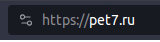
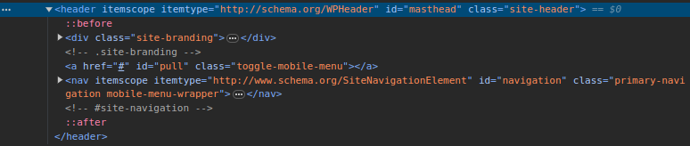
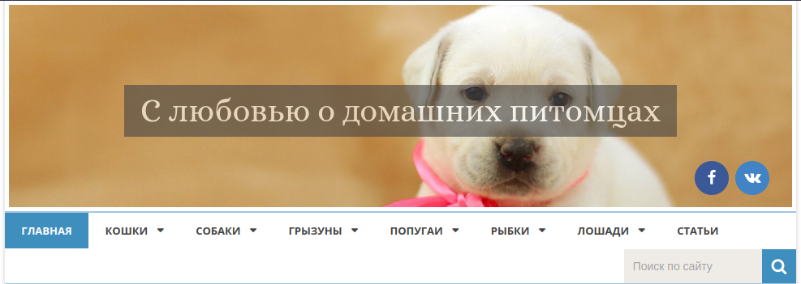
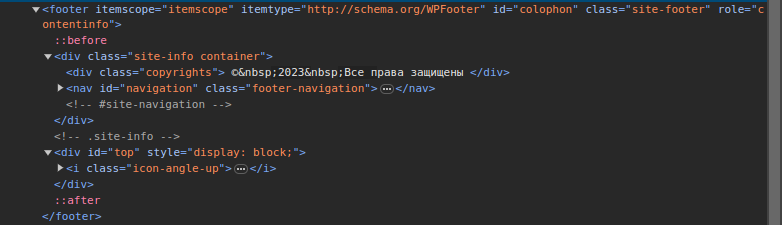
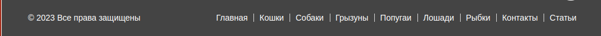
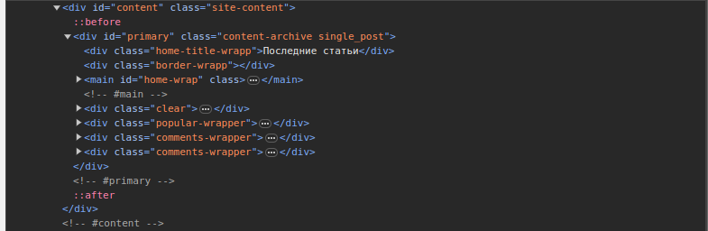
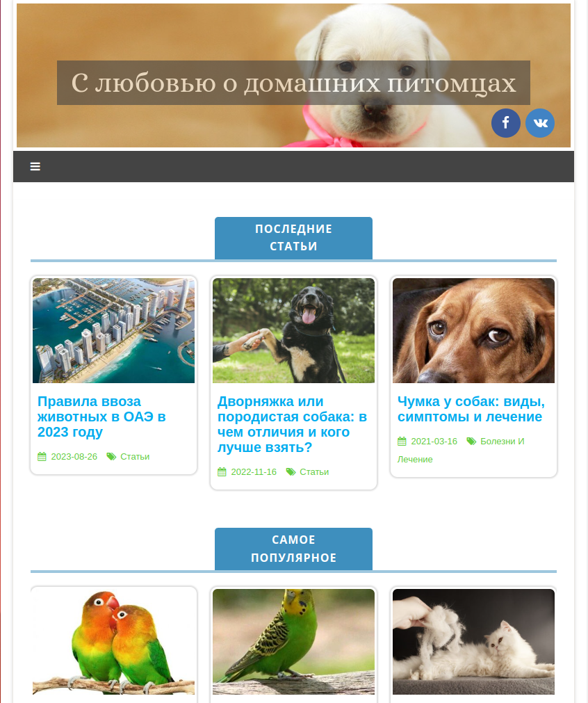
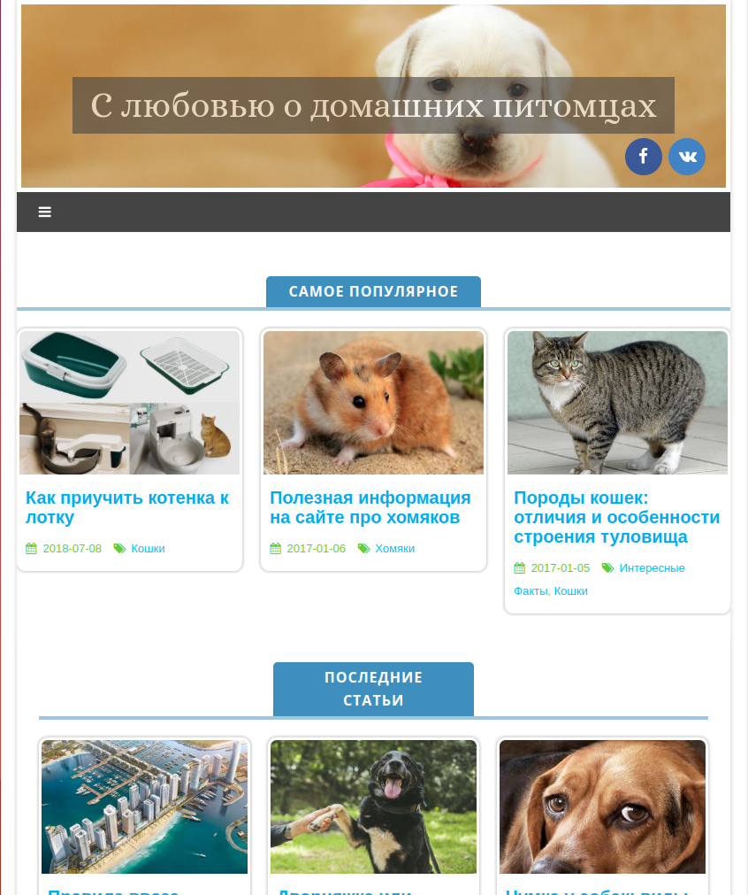
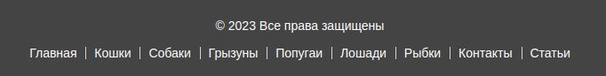
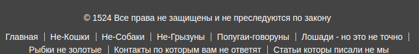

``` 
Задача: на основе сайта https://pet7.ru/
- Определите, на каком протоколе работает сайт.
- Проанализируйте структуру страницы сайта. Покажите в коде где хедер, футер и контент.
- Внесите не менее 3 изменений на страницу с помощью инструмента разработчика и представьте скриншоты было/стало.
- Создайте прототип низкой детализации. 
```
## Сайт работает на протоколе *https*



## Header



## Footer



## Content


## 1. Было

## 1. Стало

## 2. Было

## 2.Стало


## 3. Было


## 3.Стало


## Макет
https://wireframe.cc/Ok9yKO